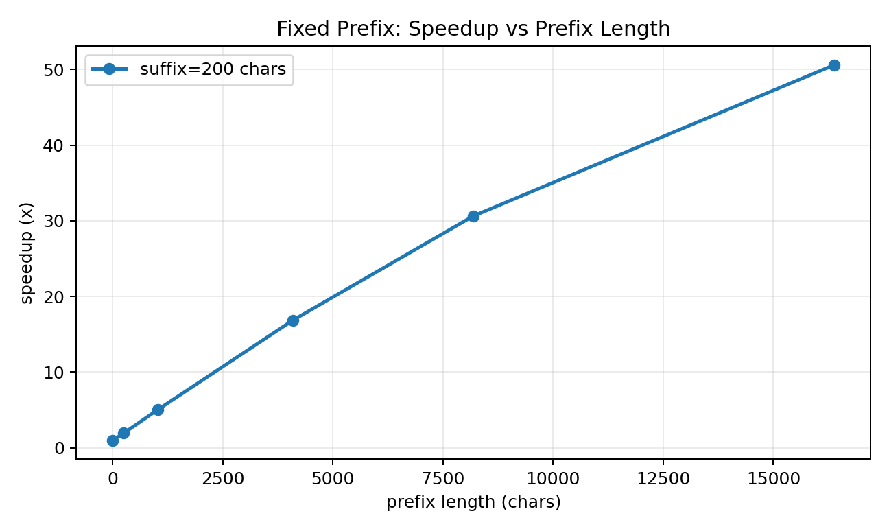
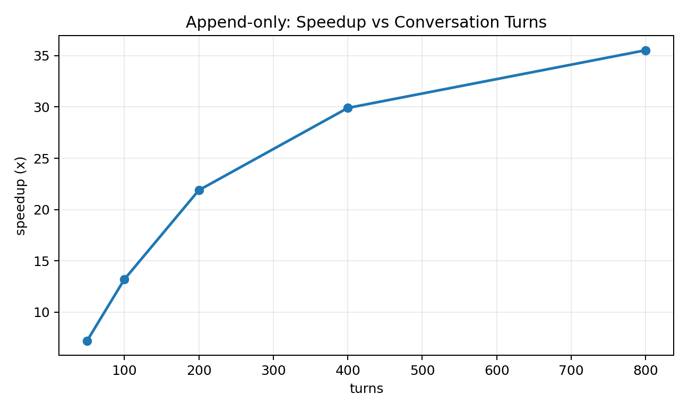
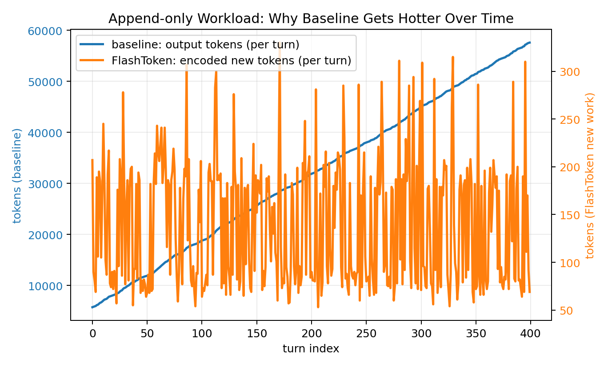
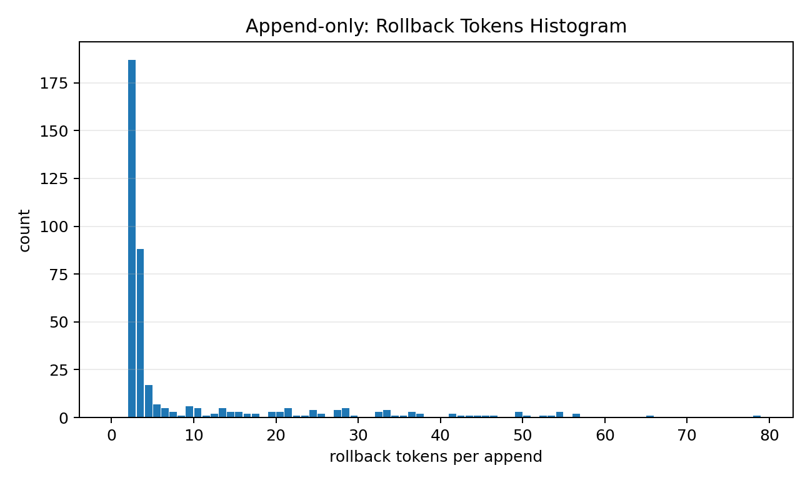

# FlashToken Benchmark Summary

## Environment
- Python: `3.12.10 (tags/v3.12.10:0cc8128, Apr  8 2025, 12:21:36) [MSC v.1943 64 bit (AMD64)]`
- Platform: `Windows-10-10.0.19045-SP0`
- CPU cores: `16`
- tiktoken: `0.12.0`
- regex: `2026.1.15`
- encoding: `cl100k_base`

## Correctness (token-by-token)
- FixedPrefixTokenCache: `mismatches == 0` -> **True**
- AppendOnlyPieceTokenCache: `mismatches == 0` -> **True**

### Correctness: Fixed Prefix
| domain | prefix_chars | suffix_chars | n | stable_prefix_tokens | unstable_tail_chars | mismatches |
| --- | --- | --- | --- | --- | --- | --- |
| english | 4096 | 256 | 200 | 935 | 2 | 0 |
| chinese | 4096 | 256 | 200 | 5337 | 3 | 0 |
| mixed | 4096 | 256 | 200 | 2260 | 3 | 0 |
| code | 4096 | 256 | 200 | 1413 | 3 | 0 |
| markdown | 4096 | 256 | 200 | 1584 | 3 | 0 |
| json | 4096 | 256 | 200 | 1763 | 3 | 0 |
| emoji | 4096 | 256 | 200 | 1357 | 1 | 0 |

### Correctness: Append-only (piece rollback)
| domain | backtrack | turns | chars/turn | rollback_max | mismatches |
| --- | --- | --- | --- | --- | --- |
| english | 1 | 200 | 96 | 3 | 0 |
| english | 2 | 200 | 96 | 6 | 0 |
| english | 4 | 200 | 96 | 10 | 0 |
| chinese | 1 | 200 | 96 | 69 | 0 |
| chinese | 2 | 200 | 96 | 80 | 0 |
| chinese | 4 | 200 | 96 | 126 | 0 |
| mixed | 1 | 200 | 96 | 70 | 0 |
| mixed | 2 | 200 | 96 | 77 | 0 |
| mixed | 4 | 200 | 96 | 125 | 0 |
| code | 1 | 200 | 96 | 2 | 0 |
| code | 2 | 200 | 96 | 3 | 0 |
| code | 4 | 200 | 96 | 5 | 0 |
| markdown | 1 | 200 | 96 | 5 | 0 |
| markdown | 2 | 200 | 96 | 6 | 0 |
| markdown | 4 | 200 | 96 | 8 | 0 |
| json | 1 | 200 | 96 | 9 | 0 |
| json | 2 | 200 | 96 | 10 | 0 |
| json | 4 | 200 | 96 | 13 | 0 |
| emoji | 1 | 200 | 96 | 11 | 0 |
| emoji | 2 | 200 | 96 | 14 | 0 |
| emoji | 4 | 200 | 96 | 17 | 0 |

## Performance Highlights (median)
- fixed_prefix: `1580.24 ms -> 57.53 ms` (`27.47x`), encoded-token reduction `~30.99x`
- append_only: `2203.70 ms -> 58.51 ms` (`37.66x`), encoded-token reduction `~229.18x`, rollback_max=`78`

### Performance: Main Cases
| kind | domain | baseline_ms | cached_ms | speedup | baseline_encoded | cached_encoded |
| --- | --- | --- | --- | --- | --- | --- |
| fixed_prefix | mixed | 1580.24 | 57.53 | 27.47x | 9717560 | 313560 |
| append_only_piece | mixed | 2203.70 | 58.51 | 37.66x | 12698415 | 55408 |

## Figures
- fixed_prefix_speedup: 
- append_only_speedup: 
- append_only_work_series: 
- append_only_rollback_hist: 

